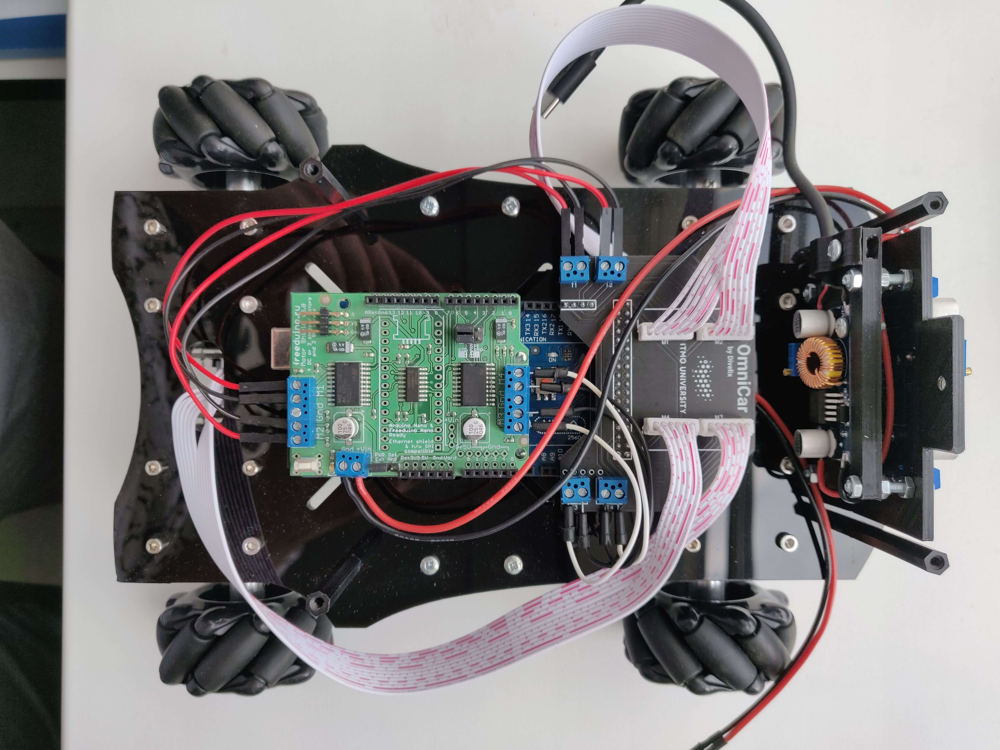
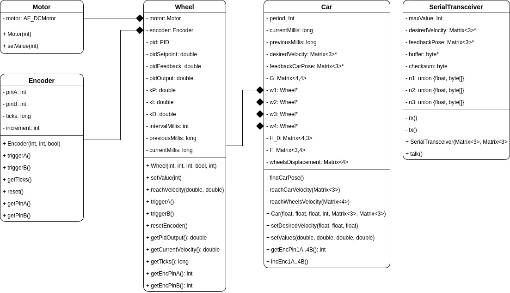

# Introduction
This repository is part of [OmniCar project](https://divelix.github.io/OmniCar/) and represents program for Arduino MEGA that solves omni platform kinematics to get wheel odometry solution and reach desired velocity.

# Showcase
Arduino MEGA runs code of this repository and placed on the 1st floor of the mobile platform. It has `Freeduino Motor Shield V3` and special power board (reduces wiring) mounted on top of it.

The platform has 4 mecanum wheels based on JGB37-520 DC motors with incremental encoders. Each encoder uses 2 interrupt pins.
Chosen configuration has only 4 free interrupt pins (other ones are used or unreachable because of motor shield): 18, 19, 20, 21 - they are used by 2 front wheels. Two rear wheels use "fake" interrupts via `PinChangeInterrupt` library: 50, 51, 52, 53.

# Structure
The project structure consists of two blocks: car control (`Car`) and serial communication (`SerialTransceiver`).

`Car` controls 4 wheels with tuned PID-controllers and calculates robot velocity by solving inverse kinematics problem and robot position by solving forward kinematics problem (dedicated theory described in [Modern Robotics](http://hades.mech.northwestern.edu/images/7/7f/MR.pdf) book, p.519).

`SerialTransceiver` receives control vector from Raspberry Pi (3 bytes) and transmits robot position in global coordinate system (12 bytes). It uses CRC8 algorithm to check message integrity.

# Prerequisites
This project was created using [PlatformIO](https://platformio.org/) IDE, so you need to install it to load code on your Arduino MEGA (or just copy all classes to Arduino IDE).